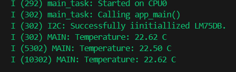

# ESP32 LM75DB Temperature Sensor

This project uses an ESP32 and an LM75DB sensor to measure temperature using the ESP-IDF framework.

## Wiring
### LM75DB → ESP32
- VCC → 3V3
- GND → GND
- SDA → GPIO21
- SCL → GPIO22

- Add 4.7kΩ pull-up resistors between VCC and both SDA and SCL.

## Build and flash
After connecting your esp32, open up the esp-idf terminal and type the following commands:

- idf.py build
- idf.py flash
- idf.py monitor

## Example output
The output from the terminal should look like the image bellow

